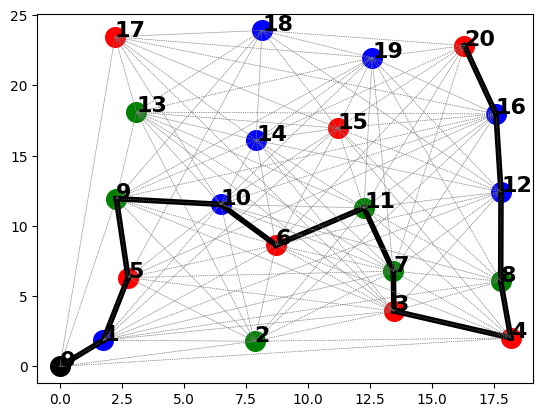

# Challenge Robotique 2023 - IMT Nord Europe
 Challenge réalisé du 30/01/23 au 03/02/23 par **Julien MÉRAND** et **Quentin DESMARTIN** dans le cadre de la semaine Challenge à l'école d'ingénieurs **IMT Nord Europe**.

## Objectifs :

Le principe de l'exercice est d'optimiser la récompense finale d'un robot qui passe par des points dont les coordonneés sont définis dans une liste. Le robot démarre d'une position 0. À chaque fois que le robot passe par un point, il empoche la récompense liée à ce point.
A chaque fois que le robot passe par un cylindre, sa masse totale augmente de la masse du cylindre et vaut donc Masse_Tot. La vitesse du robot entre deux cyclindres est de ```V = (1-exp(-600 / Masse_Tot)```.
Le robot part avec une quantité **Q = 10 L** de carburant, qu'il consomme au fur et à mesure, en fonction de Masse_Tot et de la distance parcourue entre les cylindres, selon cette fonction ```Q = Q - (7.41e-5*Masse_Tot + 1/15)*dist```.
Il faut donc veiller à optimiser le chemin pour que le robot amasse le plus de récompenses en moins de **T = 600 secondes** tout en gardant du carburant.

## Méthode de planification :

Nous construisons un graphe non orienté grâce aux coordonnées des cylindres données dans le fichier texte ``donnees-map.txt``. Ensuite, grâce à un algorithme de recherche de plus cours chemin passant par tous les noeuds (Shortest Hamiltonian Path), nous pouvons déterminer l'ordre dans lequel le robot doit récolter les cylindres.

Voici le chemin obtenu lorsque le robot se déplace à 1m par secondes :



## Gestion des déplacements :

Nous raisonnons de manière géométrique. En effet, nous calculons l'angle entre le robot et le cylindre visé pour corriger la trajectoire du robot.
Si nous avions eu plus de temps, nous aurions rajouté de la vision (via openCV, filtre HSV, extraction de contours) pour rendre les déplacements plus précis.

## Performances : 

Le robot mets **531 secondes** et parcours un total de **59 m** pour récolter les **13 cylindres** et il lui reste, à la fin, **5.3 L** de carburants.  

Cela conduit à une récompense de **9650**.

